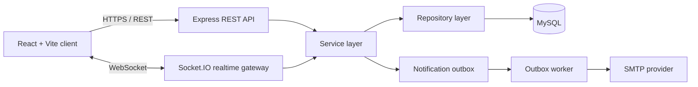

# ChatSphere

ChatSphere is a full-stack real-time messaging application built as a production-oriented backend engineering project. It combines a React client, an Express API, Socket.IO realtime delivery, MySQL persistence, session management, account verification, and layered backend architecture.

> Status: active development / portfolio project. The repository is intended to demonstrate backend architecture, security decisions, realtime messaging, relational data modelling, and production-minded engineering.

## What it supports

- User registration and account verification by email
- Login, logout, access-token refresh and session restoration
- Short-lived JWT access tokens with rotating refresh sessions
- HttpOnly refresh-token cookie handling
- One-to-one conversations
- Group creation and group-member management
- Group rename, role management, ownership transfer and leave flow
- Persistent message history
- Socket.IO realtime messaging and presence
- User search
- Notification outbox processing
- Request logging, centralized error handling and rate limiting
- Sequelize migrations and relational database constraints

## Architecture



The backend is deliberately separated into routes, controllers, services, repositories, models, middleware, validators, configuration and realtime/socket modules. Business rules live in services while repositories isolate persistence concerns.

## Repository layout

```text
ChatSphere/
├── client/                  # React/Vite frontend
│   ├── src/api/             # REST client modules and token handling
│   ├── src/auth/            # Auth context, provider and route protection
│   ├── src/components/      # Messaging/group UI components
│   ├── src/pages/           # Auth and chat pages
│   └── src/realtime/        # Socket.IO client integration
├── server/
│   ├── src/config/          # Environment, DB, JWT, mail and logging config
│   ├── src/controllers/     # HTTP request orchestration
│   ├── src/middleware/      # Auth, rate limiting, request/error handling
│   ├── src/migrations/      # Sequelize schema migrations
│   ├── src/models/          # Sequelize models
│   ├── src/repositories/    # Persistence/data-access layer
│   ├── src/routes/          # REST endpoints
│   ├── src/services/        # Domain/business logic
│   ├── src/sockets/         # Socket authentication, rooms and messaging
│   ├── src/utils/           # Tokens, passwords, crypto and identity helpers
│   ├── src/validators/      # Request validation
│   └── src/workers/         # Notification outbox worker
├── .gitignore
└── README.md
```

## Security-oriented design

The project includes several controls that are easy to omit in a basic chat application:

- Environment validation with Zod and fail-fast startup
- Helmet security headers
- Strict CORS origin configuration
- Small JSON request-body limit
- Password hashing
- JWT access-token validation
- Rotating refresh sessions with replay/reuse detection logic
- HttpOnly refresh cookie with production `secure` mode
- Authentication middleware for protected HTTP routes
- Socket authentication before realtime access
- Per-flow rate limiting for login, registration, verification, refresh and search
- Structured Pino logging with sensitive-field redaction
- Centralized API error handling so internal server details are not sent directly to clients
- Encrypted notification-outbox payload support
- Database migrations, constraints and indexes for relational consistency

## Main REST surface

### Authentication

```text
POST /api/auth/register
POST /api/auth/resend-verification
POST /api/auth/verify
POST /api/auth/login
POST /api/auth/refresh
POST /api/auth/logout
```

### Users

```text
GET /api/users/search
```

### Conversations and messages

```text
GET    /api/conversations
POST   /api/conversations/direct
POST   /api/conversations/group
GET    /api/conversations/:conversationId/group
PATCH  /api/conversations/:conversationId/group
POST   /api/conversations/:conversationId/members
DELETE /api/conversations/:conversationId/members/:memberId
PATCH  /api/conversations/:conversationId/members/:memberId/role
POST   /api/conversations/:conversationId/owner-transfer
POST   /api/conversations/:conversationId/leave
POST   /api/conversations/:conversationId/messages
GET    /api/conversations/:conversationId/messages
```

### Health

```text
GET /api/health
```

## Tech stack

### Backend

- JavaScript / Node.js
- Express 5
- Socket.IO
- MySQL
- Sequelize ORM + Sequelize CLI
- Zod
- JSON Web Tokens
- Argon2 / bcrypt
- Nodemailer / SMTP
- Pino
- Helmet
- express-rate-limit

### Frontend

- React 19
- Vite
- React Router
- Axios
- Socket.IO Client

## Local setup

### 1. Requirements

- Node.js 22 recommended
- npm
- MySQL 8+
- SMTP credentials for account verification

### 2. Clone and install

```bash
git clone <your-repository-url>
cd ChatSphere

cd server
npm ci

cd ../client
npm ci
```

### 3. Configure the backend

```bash
cd server
cp .env.example .env
```

Fill in the required database, authentication and SMTP values in `server/.env`.

Generate secure values rather than reusing examples. For example:

```bash
node -e "console.log(require('crypto').randomBytes(32).toString('hex'))"
node -e "console.log(require('crypto').randomBytes(32).toString('base64'))"
```

The real `.env` file is intentionally ignored by Git.

### 4. Configure the client

```bash
cd client
cp .env.example .env
```

Default local API configuration:

```env
VITE_API_BASE_URL=http://localhost:5000/api
```

### 5. Run database migrations

```bash
cd server
npx sequelize-cli db:migrate
```

### 6. Start the backend

```bash
npm run dev
```

### 7. Start the frontend

In another terminal:

```bash
cd client
npm run dev
```

The Vite client normally runs at `http://localhost:5173` and the API at `http://localhost:5000`.

## Verification notes

- Server JavaScript source passes `node --check` syntax validation in the prepared repository.
- Real database startup and end-to-end messaging require a configured MySQL instance and SMTP provider.
- Secrets are intentionally excluded from version control; only `.env.example` templates belong in the repository.

## Engineering goals

ChatSphere is being developed with the following priorities:

1. correctness before feature count;
2. explicit authentication and authorization boundaries;
3. durable relational state rather than browser-only chat state;
4. realtime delivery without making Socket.IO the system of record;
5. observable failure handling;
6. a codebase that can be understood, tested and extended by another engineer.

## Author

**Godson Okutu**  
Backend-focused software developer based in Ghana  
Portfolio: [godsonokutu.dev](https://godsonokutu.dev)
